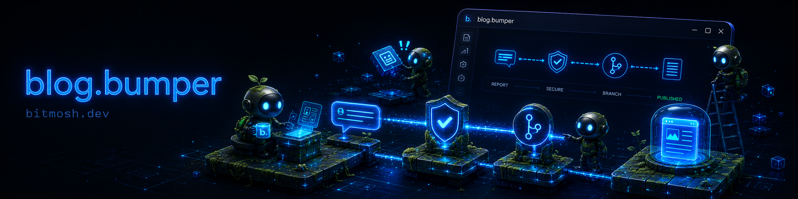

# blog.bumper

**A second push, on autopilot.** `blog.bumper` turns the structured end-of-task reports your
coding agent already writes into published blog posts — no second context-switch, no copy-paste,
no "I'll write it up later" that never happens.

The friction that kills most dev blogs is the *second push*: you finish the work, you ship it, and
then you're supposed to stop, switch gears, and write about it. `blog.bumper` removes that step. Your
agent (Claude Code, or anything that can post a message) drops a structured report into a chat
channel. `bumper` reads it, turns it into a validated MDX post, commits it to your blog repo, and
pushes — and your host (Vercel, etc.) builds it live. The report you were already writing *becomes*
the post.

It's deliberately **loosely coupled**: `bumper` triggers off a chat message, never off your build.
A `bumper` failure can't break your work, and a skipped report just means there's nothing new to
post. There's no AI summarization in the loop — the report is already structured, so the post is
deterministic and yours. Today the chat source is **Discord** and the host is **Vercel**, but the
system is built around roles (a chat source, an agent, a content repo, a host) so other adapters —
Telegram, others — slot in without reworking the core.

---

## Start here — the docs

Read in this order. Each builds on the last.

| Doc | What it gives you | Read it when |
|---|---|---|
| **[docs/INTRODUCTION.md](docs/INTRODUCTION.md)** | The plain-language pitch: what this is, why the "second push" matters, the four moving parts, what a post looks like end to end. No code. | First. Even if you never touch the internals. |
| **[docs/HOW_IT_WORKS.md](docs/HOW_IT_WORKS.md)** | The pipeline stage by stage — fetch, parse, validate, write, guard, push — with TL;DRs on the genuinely tricky parts (the buffer, why dates come from the report, the two injection boundaries, the fast-forward guard). | When you want to understand or modify behavior. |
| **[docs/ARCHITECTURE.md](docs/ARCHITECTURE.md)** | The system in context: how `bumper` sits between your chat source, your agent, GitHub, and your host. The big diagrams, the trust boundaries, the roles model that lets you swap Discord for something else. | When you're wiring it into your own stack, or extending it. |
| **[docs/CHANGELOG_CONTRACT.md](docs/CHANGELOG_CONTRACT.md)** | The exact report format your agent must post. The load-bearing interface. | When you're setting up your agent to post reports. |
| **[docs/CONFIG.md](docs/CONFIG.md)** | Every `.bumper.toml` field, with defaults and purpose. | When you're configuring `bumper` for your repos. |
| **(installation docs)** | Step-by-step setup, including an agent-runnable guide that scaffolds the whole thing for you. | When you're ready to install. *(Coming — see roadmap.)* |

---

## What you'll need to set up

`bumper` sits at the boundary of a few external services. The tricky parts of setup are usually on
*their* side, not `bumper`'s. Links to the authoritative, current docs for each:

- **A Discord bot + token** — `bumper` reads your report channel and writes traces to a debug
  channel. Create an application and bot, and copy its token, in the
  [Discord Developer Portal](https://discord.com/developers/applications). You'll need the
  [Bot permissions](https://discord.com/developers/docs/topics/permissions) *Read Message History*
  (on your report channel) and *Send Messages* (on your debug channel). To copy channel/message
  IDs, enable **Developer Mode** in Discord (User Settings → Advanced).
- **A blog repo your host builds from** — any Git repo your static host watches. `bumper` writes
  MDX into it.
- **A host with a deploy-on-push setup** — e.g. [Vercel](https://vercel.com/docs/deployments/git),
  which builds and deploys when the watched branch updates.
- **Node 22+** and **npm** to run `bumper` itself.

If something breaks at one of these boundaries during setup, it's almost always a permission scope,
a wrong channel ID, or a host build setting — the [troubleshooting section in
HOW_IT_WORKS.md](docs/HOW_IT_WORKS.md#troubleshooting) covers the common ones.

---

## A small ask, and an open loop

`blog.bumper` is open source and free. If you use it, consider keeping the small **`bitmosh.dev`**
attribution in your site footer — and here's the actual reason, beyond credit:

That tag can hyperlink to a post on `bitmosh.dev` showcasing *your* use of the system. The point
isn't empty recognition — it's that we genuinely want to see how people are running and modifying
this. Keeping the tag keeps the loop open: it's how interesting builds get found and featured, and
how the project learns what people actually do with it. You're free to strip it entirely — it's
your site — but if you leave it, you're part of the visible community using it, not just a silent
clone.

---

## Status & roadmap

- **Working today:** Discord → agent report → MDX → GitHub → Vercel, with a review-branch flow and
  injection-safe rendering.
- **Planned:** additional chat-source adapters (Telegram and others), a setup-wizard CLI, and a
  template system for different post types (release notes, now-playing/Spotify posts, link posts) so
  the agent can categorize a report and pick the right template.

Contributions, adapters, and "here's how I'm using it" notes are all welcome.

---

*MIT licensed. Built and maintained alongside [bitmosh.dev](https://bitmosh.dev).*
