# Architecture — the system in context

> **TL;DR** — `bumper` is a stateless CLI that sits between four external systems: a **chat source**
> (Discord), an **agent** (Claude Code or any poster), a **content repo** (GitHub), and a **host**
> (Vercel). It owns none of them — it reads from one, writes to another, and the rest run as they
> already do. This doc covers how they connect, where the trust boundaries are, and the parts of
> setup that most commonly go wrong.

If you've read [HOW_IT_WORKS.md](HOW_IT_WORKS.md), you know the pipeline. This doc is about
everything *around* the pipeline: the systems it integrates, what each is responsible for, and how
to wire it into your own stack (which may not look like the reference setup).

---

## The roles model (read this first — it's why the system survives change)

`bumper` is designed around four **roles**, not four products. Today each role is filled by a
specific tool, but the architecture only depends on the role's *contract*, not the tool. This is
deliberate: it's what lets Discord become Telegram, or Vercel become Netlify, without touching the
core.

| Role | Contract (what the role must do) | Today | Swappable to |
|---|---|---|---|
| **Chat source** | Hold a channel of timestamped messages `bumper` can fetch by recency or ID; accept messages `bumper` posts (traces). | Discord (REST API) | Telegram, Slack, a webhook, a file — anything with "read messages / post message". |
| **Agent** | Produce a report in the [changelog contract](CHANGELOG_CONTRACT.md) format and post it to the chat source. | Claude Code (Bandit) | Any agent, script, CI job, or human who can post the format. |
| **Content repo** | A Git repo whose content directory holds dated post folders, validated by a schema at build. | GitHub repo | Any Git host (GitLab, Gitea, self-hosted). |
| **Host** | Build and deploy the content repo on push to a watched branch. | Vercel | Netlify, Cloudflare Pages, GitHub Pages + Action, any deploy-on-push host. |

> **Why this matters for adopters:** your stack probably differs from the reference one in at least
> one role. That's fine. As long as each role's contract is met, `bumper` works. The only role
> currently hard-coded to one implementation is the **chat source** (Discord REST) — adding a new
> one means writing a small adapter, not rearchitecting. Telegram is the next planned adapter.

---

## The system, end to end

```mermaid
flowchart TB
    subgraph SRC["SOURCE SIDE (your work)"]
        DEV["you + your agent<br/>finish a task"]
        AGENT["agent posts a<br/>structured report"]
        DEV --> AGENT
    end

    subgraph CHAT["CHAT SOURCE · Discord today"]
        CHAN["#changelog<br/><small>report channel (read-only to bumper)</small>"]
        DBG["#debug<br/><small>trace channel (bumper writes here)</small>"]
    end

    subgraph BUMPER["bumper · the CLI (stateless)"]
        FETCH["fetch + buffer"]
        PARSE["parse"]
        VALID["validate (Zod)"]
        RENDER["render safe MDX"]
        GIT["git driver + FF guard"]
        FETCH --> PARSE --> VALID --> RENDER --> GIT
    end

    subgraph REPO["CONTENT REPO · GitHub"]
        BRANCH["review branch<br/>(e.g. blog/dev)"]
        MAIN["live branch<br/>(main)"]
        BRANCH -->|human review + merge| MAIN
    end

    subgraph HOST["HOST · Vercel today"]
        BUILD["build (validates schema,<br/>compiles MDX)"]
        LIVE([live blog])
        BUILD --> LIVE
    end

    AGENT -->|posts to| CHAN
    CHAN -->|bumper reads| FETCH
    GIT -->|writes trace| DBG
    GIT -->|commit + push| BRANCH
    MAIN -->|deploy on push| BUILD

    style BUMPER fill:#0f1f0f,stroke:#a6f35a
    style LIVE fill:#1a2a2a,stroke:#22e0c4
    style MAIN fill:#1a1f2a,stroke:#5aa6f3
```

The key structural facts in that diagram:

- **`bumper` reads the report channel and writes only to the debug + content repo.** It never writes
  to the report channel — that channel is the agent's to write, `bumper`'s to read.
- **`bumper` is stateless.** It keeps a working clone of the content repo (at `local_clone`) but
  holds no database, no memory between runs. Everything it needs is in the config, the chat channel,
  and the repo. You can delete its clone and the next run re-creates it.
- **The review branch is a human gate.** `bumper` pushes to a review branch; a human merges to the
  live branch. The deploy only fires on the *live* branch, so nothing `bumper` does is public until
  you promote it.

---

## Trust boundaries — where untrusted data crosses into your system

> **TL;DR** — Report content is *semi-trusted*: it comes from a chat message, which is not the same
> as hand-written-by-you. `bumper` treats it as data, never as code, at every point it crosses into
> your blog. There are exactly three crossing points, and each is defended.

This is the security model. It matters because the whole premise — "parse a chat message, turn it
into a published web page" — means content from a chat platform ends up compiled into your site. If
that content could execute, you'd have a build-time code-injection path. Here's every place report
data crosses a boundary and how it's contained:

```mermaid
flowchart LR
    UNTRUSTED["report text<br/>(semi-trusted:<br/>from a chat message)"]

    UNTRUSTED --> X1["① into YAML frontmatter<br/><small>title, description, etc.</small>"]
    UNTRUSTED --> X2["② into the MDX body<br/><small>changelog bullets</small>"]
    UNTRUSTED --> X3["③ into component attributes<br/><small>version, date</small>"]

    X1 --> D1["serialized by a YAML library<br/><small>structurally can't break the block</small>"]
    X2 --> D2["JSON string array prop<br/><small>compiler sees data, not code</small>"]
    X3 --> D3["serialized as inert expressions<br/><small>not raw-interpolated</small>"]

    D1 --> SAFE([safe .mdx])
    D2 --> SAFE
    D3 --> SAFE

    style UNTRUSTED fill:#3a1a1a,stroke:#ff5bc7
    style SAFE fill:#1a2a1a,stroke:#a6f35a
```

1. **Frontmatter (YAML).** Metadata is built as a data object and serialized by a YAML library.
   Structural attacks (a colon, quote, leading `>`, or newline in a title) can't break the block —
   the serializer quotes them.
2. **Body (executable MDX).** Changelog bullets are passed as a JSON string array to a component.
   The MDX compiler sees an array literal of strings; hostile content (`<script>`, `{expr}`) renders
   as visible text, never executes.
3. **Component attributes.** Values like version and date are serialized as inert JSON expressions,
   not interpolated into the attribute string — so safety doesn't rely on the parser regex upstream
   having held.

> **The one thing `bumper` can't defend, and you should know:** the chat platform can corrupt content
> *before `bumper` ever sees it*. Discord, for example, rewrites a bare `#channel-name` mention into
> a channel link, which can leave a garbled token in the text. `bumper` faithfully stores what it
> received — the corruption is upstream. **Mitigation: don't put bare `#name` references in report
> prose.** Write "the debug channel" instead. This is documented in the
> [changelog contract](CHANGELOG_CONTRACT.md) and `bumper` emits a parse-time warning if it detects
> a surviving channel-mention token.

---

## The schema: one definition, two enforcers

The post's frontmatter schema is the contract between `bumper` (which *writes* posts) and your blog's
content pipeline (which *validates* posts at build). They must agree, or you get posts that `bumper`
happily writes and the build then rejects.

```mermaid
flowchart LR
    SCHEMA["the 12-field schema<br/><small>title, description, date, time,<br/>section, category, module, version,<br/>tags, status, commit, bumpedBy</small>"]
    SCHEMA --> W["bumper's copy<br/><small>(Zod) — validates before writing</small>"]
    SCHEMA --> B["blog's copy<br/><small>(velite/Zod) — validates at build</small>"]
    W -->|writes a post| POST["index.mdx"]
    POST -->|build validates| B
    style SCHEMA fill:#1a1f2a,stroke:#5aa6f3
```

> **Common mistake:** changing the schema in one place and not the other. If you add a field or
> tighten a constraint in your blog's content config but not in `bumper`'s schema (or vice versa),
> `bumper` will write posts that fail the build — or reject posts the build would accept. **Keep the
> two definitions in sync.** They're currently duplicated (one in each repo); a shared package is
> the long-term fix. Until then, treat a schema change as a two-repo change.

Because `bumper` validates with its *own* copy before writing, a drift is usually caught at write
time (you get a validation refusal) rather than silently producing a broken build — but only if the
drift makes `bumper`'s schema *stricter*. If the blog's schema is the stricter one, the failure shows
up at build instead. Sync both.

---

## State and the working clone

`bumper` keeps a working clone of your content repo at the `local_clone` path (default
`~/.bumper/<repo>`). Things worth knowing:

- **It's disposable.** Delete it and the next run re-clones. If the clone ever gets into a weird
  state (a half-applied change, a stale branch), `rm -rf` the clone directory and re-run — this is a
  legitimate reset, not a hack.
- **It's a real checkout, not a bare clone.** `bumper` writes the post into its working tree, runs
  the fast-forward guard against the remote, then commits and pushes.
- **It caches between runs.** On the first run it clones; after that it fetches. This is faster but
  it's also why a stale clone can carry an old post forward — see the gotcha below.

> **Common mistake — the stale clone reintroducing a deleted post.** If you delete a post from the
> remote branch but `bumper`'s local clone still has it, a subsequent run can carry that file back in
> (the clone's working tree still contains it). If you clean up posts on the remote, either
> `rm -rf` `bumper`'s clone afterward (it'll re-clone fresh) or pull the deletion into the clone. This
> is the most common "why did that post come back?" confusion.

---

## How the agent integrates (loose coupling, concretely)

The agent does exactly one `bumper`-related thing: **post a report to the chat channel in the
[contract format](CHANGELOG_CONTRACT.md).** It does not call `bumper`, know `bumper`'s config, or
depend on `bumper` succeeding.

```mermaid
flowchart LR
    subgraph AGENTFLOW["the agent's normal workflow"]
        WORK["do the task"] --> SHIP["commit + push the work"] --> REPORT["post a report<br/>to #changelog"]
    end
    REPORT -.->|completely separate, later| BUMP["bumper runs<br/>(manual or scheduled)"]
    style BUMP fill:#0f1f0f,stroke:#a6f35a
```

The dashed line is the point: there's no synchronous call. The agent's job ends at "posted a
report." `bumper` runs on its own — invoked by you, a cron job, or a scheduled task — and reads
whatever's in the channel. Consequences:

- A `bumper` bug **cannot** break the agent's workflow or your deploy.
- The agent needs **no credentials** for the blog repo — only `bumper` does.
- You can test, replay, or backfill any report independently with `--msg <id>`.

> **Setup note:** to turn this on, you add one instruction to your agent's end-of-task routine —
> "post a report to the changelog channel in this format" — and nothing else. Do **not** wire a
> `bumper` invocation into the agent. The looseness is the feature. (And it's worth proving the full
> `bumper` pipeline end-to-end *before* you automate the agent's posting, so you're not generating
> reports into a channel whose downstream you haven't tested.)

---

## Adapting to your own stack — a checklist

Each role, what to verify, and the most common mistake:

**Chat source (Discord today)**
- Create a bot, grant it *Read Message History* on the report channel and *Send Messages* on the
  debug channel, put its token in `.env`.
- *Common mistake:* setting permissions at the server role level but not on the specific channel —
  channel-level overrides win. Set them on the channel.
- *Common mistake:* using a channel ID where a guild (server) ID is expected, or vice versa, in the
  `discord://<guild-id>/<channel-id>` URI. Both IDs are needed; they're different numbers.

**Agent**
- Configure it to post the contract format to the report channel as its final step.
- *Common mistake:* the agent's report format drifting from the contract. The parser is built for one
  format; if reports vary, parsing fails. Standardize the agent's output. (Legacy/ad-hoc reports
  from before you standardized won't parse — they need hand-mapping for backfill, not the parser.)

**Content repo (GitHub today)**
- A content directory with the dated-folder structure, and a build-time schema matching `bumper`'s.
- *Common mistake:* no content pipeline set up yet. `bumper` writing the MDX is only half the system —
  the blog has to *render* it. Building that pipeline (the schema, the routes, the components that
  consume the post) is its own task. `bumper`'s output targets components like `<Changelog items={}>`
  — your blog must provide them.

**Host (Vercel today)**
- Deploy-on-push wired to your **live** branch (not the review branch, unless you also want preview
  deploys of the review branch — which is handy).
- *Common mistake:* expecting `bumper` to trigger the deploy. It doesn't. It pushes; your host's
  existing git integration deploys. If pushes aren't deploying, that's a host setting, not a `bumper`
  bug.

---

## Branching model — why the review branch exists

```mermaid
flowchart LR
    BUMP["bumper pushes"] --> DEV["review branch<br/>(blog/dev)"]
    DEV --> REVIEW{human glances:<br/>post correct?}
    REVIEW -->|yes| MERGE["merge → live branch"]
    REVIEW -->|no| FIX["delete/fix on the branch<br/><small>nothing was public</small>"]
    MERGE --> DEPLOY([host deploys · live])
    style DEPLOY fill:#1a2a1a,stroke:#a6f35a
```

`bumper` is hard-coded to refuse pushing directly to a `main` branch on the content repo. Posts land
on a review branch; you merge to live. This is what makes the system safe to run semi-automatically:
a wrong post (wrong content, a test fixture, a parse oddity) lands somewhere private and disposable,
not on your public site.

> **When to loosen it:** once you trust the pipeline for a given repo, you *can* point
> `[target].branch` at your live branch for direct posting. Do this deliberately, not by default —
> the review branch costs you one merge and buys you a checkpoint. Most people keep it.

---

**Next:** [CONFIG.md](CONFIG.md) for every setting, or [CHANGELOG_CONTRACT.md](CHANGELOG_CONTRACT.md)
for the report format your agent must produce.
