# The report contract — what your agent posts

> **TL;DR** — Your agent posts a plain-text report to the chat channel in this exact format.
> `bumper` parses it into a post. The format is the **load-bearing interface** between your agent and
> `bumper`: get it stable and parsing is trivial; let it drift and parsing fights you forever. This is
> the one thing you must configure on the agent's side.

This is the format `bumper`'s parser expects. It's designed to be both **machine-parseable** (one
consistent structure) and **human-readable** (a normal-looking chat message). For how the parsed
fields become a post, see [HOW_IT_WORKS.md](HOW_IT_WORKS.md#stage-2--parse-the-report).

> The report channel is **write-once by your agent.** Your agent posts reports there and nothing
> else. `bumper`'s traces go to the *debug* channel, not here. Keeping the report channel clean (only
> agent reports) is what keeps the buffer predictable.

---

## The format

```
── PASS COMPLETE · v<X.Y> · <YYYY-MM-DD> ──────────────────────

Title: <4–8 words, blog-suitable, not a commit message>
Summary: <one sentence, 20–200 chars — becomes the post description>
Project: <one of your module values>   ← optional; omit to use the config default

Highlights:
· <concrete change — what changed, not which file>
· <concrete change>
· <concrete change>

Learnings:
· <optional — an insight worth keeping>
· <optional>

Commit: <7-char commit hash>
Tests: <N> passed · <M> failed · <K> skipped
Branch: clean
```

That `── PASS COMPLETE ·` header is the **format signature** — it's how `bumper` recognizes a report
it can parse (and how it'll tell future format versions apart). The bullet character is `·` (middle
dot).

---

## Field rules

| Field | Required | Rule |
|---|---|---|
| Header version `v<X.Y>` | yes | Your version/release identifier. Drives the post's `version`, its `tags`, and the URL slug prefix. Format: `v` then numbers and dots (`v1.2`, `v0.3.1`). |
| Header date `<YYYY-MM-DD>` | yes | ISO date of the work. Drives the day-container folder and the post `date`. |
| `Title:` | yes | 4–8 words, blog-suitable. This is the post's headline — independent of any commit message. |
| `Summary:` | yes | One sentence, **20–200 chars**. Becomes the post `description` (cards, meta tags). |
| `Project:` | no | One of your module values. Omitted → uses `[source].module` from config. |
| `Highlights:` | yes | 3–5 `·` bullets. Rendered **verbatim** into the post as the changelog. Describe *behavior*, not files. |
| `Learnings:` | no | `·` bullets. Captured but not shown on the live page (kept in source for later). |
| `Commit:` | yes | A 7-character commit hash. Drives the post `commit` field and the duplicate check. |
| `Tests:` | no | Observability only — goes to the debug trace, **never** into the post. |
| `Branch:` | no | Observability only. |

### Why each required field is required

- **Header version + date** — these are the post's identity and where it files. Without them there's
  no slug and no day-container.
- **`Title:`** — the parser needs an explicit, blog-suitable title. Commit messages make bad titles
  (they're terse and implementation-focused); the explicit field gives you editorial control
  separate from the commit.
- **`Summary:`** — becomes the `description`, which has a **20-char minimum** (validation enforces it).
  A 4–8 word title alone is often under 20 chars, which is exactly why `Summary:` is separate and
  required. *(If `Summary:` is missing, the parser falls back to the first highlight — but a too-short
  result still fails validation, so just include the summary.)*
- **`Highlights:`** — the actual content of the post. At least one is needed.
- **`Commit:`** — the duplicate-detection key. Re-running a report with the same commit is a safe
  skip; without it there's no idempotency.

---

## How fields become a post

```mermaid
flowchart LR
    H["header version + date"] --> V["post version, date, slug prefix, tags"]
    T["Title:"] --> PT["post title + slug"]
    S["Summary:"] --> D["post description"]
    P["Project:"] --> M["post module<br/><small>(or config default if omitted)</small>"]
    HI["Highlights:"] --> CL["the rendered changelog<br/><small>(verbatim, as inert text)</small>"]
    L["Learnings:"] -.kept in source, not shown.-> CO["commentary block"]
    C["Commit:"] --> CM["post commit + duplicate key"]
    TS["Tests: / Branch:"] -.-> DBG["debug trace only"]

    style CL fill:#1a2a1a,stroke:#a6f35a
    style DBG fill:#1a1f2a,stroke:#5aa6f3
```



The slug is built as `<version-kebab>-<title-kebab>` — e.g. version `v1.2` + title "New login flow"
→ `v1-2-new-login-flow` (lowercased, punctuation stripped, spaces to hyphens).

---

## Writing good reports

The format parses regardless, but these make for *good posts*:

- **Highlights describe behavior, not implementation.** Write "hover now debounces, cutting redundant
  network calls" — not "edited `useHover.ts`, added a `setTimeout`." Readers of a blog want the what
  and why, not your file diff. (Your file names also mean nothing to them.)
- **Title is a headline, not a commit subject.** "Settings now render from a registry" reads as a
  post; "refactor: extract category registry" reads as a commit.
- **Summary is one real sentence.** It's what shows on the post card and in search results. Make it
  stand alone.
- **Keep highlights to 3–5.** Enough to convey the work, few enough to scan.

---

## Common mistakes

> **Bare `#channel` references get corrupted before `bumper` sees them.** This is the big one. If your
> `Summary:` or `Highlights:` contain a bare `#name` (like `#debug` or `#general`), Discord rewrites
> it into a channel link *in the posted message*, which can leave a garbled or invisible character in
> the text `bumper` reads. The corruption happens upstream — `bumper` faithfully stores what arrived.
> **Fix: don't write bare `#name` in report prose.** Say "the debug channel" instead. `bumper` emits a
> parse-time warning if it detects a surviving channel-mention token, but the real fix is at writing
> time.

> **Format drift breaks parsing.** The parser is built for *this* format. If your agent sometimes
> writes `-- DONE --` and sometimes `── PASS COMPLETE ·`, or moves the commit hash around, parsing
> fails on the variants. **Standardize the agent's output to exactly one format.** (If you have old,
> ad-hoc reports from before you standardized, they won't parse — they need hand-mapping for
> backfill, not the parser. Don't try to make the parser tolerate every historical shape.)

> **Missing `Commit:` is the most common hard parse failure.** It's required and there's no fallback.
> If a report has no commit hash, `bumper` saves the raw text to `parse-failures/`, traces the failure
> naming the `commit` field, and exits non-zero. Make sure your agent always includes it.

> **A too-short `Summary:` passes parsing but fails validation.** The parser accepts it; the schema
> then refuses it (20-char minimum on `description`). You'll see a validation refusal, not a parse
> error. Write a real sentence.

---

## Setting up your agent to post this

The integration is **loose**: your agent posts this report as the final step of its workflow, and
that's *all*. Do **not** wire a `bumper` invocation into the agent — `bumper` runs separately and reads
the channel. (Why this matters: [ARCHITECTURE.md](ARCHITECTURE.md#how-the-agent-integrates-loose-coupling-concretely).)

Add an instruction to your agent's end-of-task routine along these lines:

```
As the final step of every completed task, post a report to the report channel
(and ONLY the report channel) in exactly this format:

── PASS COMPLETE · v{version} · {ISO date} ──────────────────────

Title: {4–8 word blog-suitable title}
Summary: {one sentence, 20–200 chars}
Project: {module value, or omit to use the repo default}

Highlights:
· {3–5 concrete behavioral changes — what changed, not file names}

Learnings:
· {optional insights}

Commit: {7-char commit hash}
Tests: {N} passed · {M} failed · {K} skipped
Branch: clean

Rules:
- version = the release/pass identifier (v1.2)
- title = blog-suitable, NOT the commit subject
- summary = one readable sentence; this is the post's description
- highlights = behavior, not implementation
- do NOT put bare #channel-name references in the text
- post nothing else to this channel
```

That's the only change on the agent's side. Everything else is `bumper`'s job.

> **Sequencing tip:** prove the full `bumper` pipeline end-to-end (with a hand-posted report and the
> `--dry` flag) **before** you turn on the agent's automatic posting. That way you're not generating
> real reports into a channel whose downstream you haven't tested yet.

---

## Versioning the format

The header signature lets the format evolve without breaking old parsing. A future format variant
would use a distinct header (e.g. `── PASS COMPLETE v2 ·`) and `bumper` would dispatch to the matching
parser. For now there's one format — the one above. If you customize it, keep the header signature
recognizable and update `bumper`'s parser to match.

---

**Back to:** [README](../README.md) · [HOW_IT_WORKS.md](HOW_IT_WORKS.md) · [ARCHITECTURE.md](ARCHITECTURE.md) · [CONFIG.md](CONFIG.md)
