# How it works — the pipeline, stage by stage

> **TL;DR** — `bumper` runs as a single command. It fetches one report from your chat channel,
> parses it into structured data, validates it, renders it into a safe MDX file, checks the blog
> repo is in a clean state, commits, and pushes. Each stage can stop the run cleanly if something's
> wrong. Nothing is summarized, guessed, or force-pushed.

This doc explains what happens when you run `bumper bump`, in order. The genuinely tricky parts —
the ones that confuse people — have their own TL;DR boxes. For how `bumper` fits your broader stack,
see [ARCHITECTURE.md](ARCHITECTURE.md); for the report format, [CHANGELOG_CONTRACT.md](CHANGELOG_CONTRACT.md).

---

## The whole pipeline at a glance

```mermaid
flowchart TD
    START([bumper bump]) --> CFG[load + validate .bumper.toml]
    CFG --> TOK{token present?}
    TOK -->|no| TFAIL([error: token not set · exit 1])
    TOK -->|yes| FETCH[fetch a report from the chat channel]
    FETCH --> BUF{buffer resolves<br/>to a message?}
    BUF -->|no| NOOP([quiet no-op · exit 0])
    BUF -->|yes| PARSE{parse the report}
    PARSE -->|fail| PFAIL([save raw text + trace · exit 1])
    PARSE -->|ok| VALID{frontmatter valid?}
    VALID -->|no| VFAIL([refuse · exit 1])
    VALID -->|yes| RENDER[render injection-safe MDX]
    RENDER --> DUP{post already<br/>exists for this commit?}
    DUP -->|yes| SKIP([skip · exit 0])
    DUP -->|no| WRITE[write MDX into the repo clone]
    WRITE --> FF{blog repo<br/>fast-forwardable?}
    FF -->|no| FFAIL([refuse · trace · exit 1])
    FF -->|yes| PUSH[commit + push to the target branch]
    PUSH --> DONE([host builds · post goes live])

    style NOOP fill:#1a2a2a,stroke:#22e0c4
    style SKIP fill:#2a2a1a,stroke:#f2b65a
    style TFAIL fill:#3a1a1a,stroke:#ff5bc7
    style PFAIL fill:#3a1a1a,stroke:#ff5bc7
    style VFAIL fill:#3a1a1a,stroke:#ff5bc7
    style FFAIL fill:#3a1a1a,stroke:#ff5bc7
    style DONE fill:#1a2a1a,stroke:#a6f35a
```

Every red box is a clean stop — `bumper` writes nothing and exits non-zero so you know it didn't
post. The two amber boxes are *intentional* non-actions (nothing to do / already done). Only the
green path publishes.

---

## Stage 0 — Config and token

`bumper` reads `.bumper.toml` and validates every field against a schema. A malformed config fails
here with a message naming the bad field — it never runs with half-valid settings.

It then reads your chat-source token from an environment variable (named by `token_env`, default
`DISCORD_BOT_TOKEN`). The token lives in a gitignored `.env` file, never in the config and never in
the repo. If the token is missing, `bumper` stops *before* making any network call — you get a clear
"token not set" message, not a confusing auth error.

---

## Stage 1 — Fetch a report (and the buffer)

> **TL;DR — the buffer is a review window.** By default, `bumper` posts the **second-most-recent**
> report, not the latest. This gives you a window: the newest report sits unpublished while you can
> still edit or delete it, and only becomes a post on the *next* run. Set `buffer = 0` to post the
> latest immediately. Use `--msg <id>` to target one specific report and bypass the buffer entirely.

This is the part that surprises people, so it's worth being precise.

`bumper` looks at your chat channel and picks **one** report to act on. *Which* one depends on the
`buffer` setting:

- **`buffer = 1` (the default, also `bumper bump --last`):** picks the **second-most-recent**
  message. The idea: the most recent report is "still warm" — you might want to tweak its wording or
  scrap it. By posting the *second*-newest, `bumper` always leaves the newest one as a buffer you can
  still touch. It becomes a post on the next run, by which point a newer one has taken its place as
  the buffer.
- **`buffer = 0`:** picks the **latest** message. No review window — the newest report posts
  immediately.
- **`--msg <id>`:** ignores the buffer completely and fetches exactly the message you name. This is
  how you backfill old reports or test a specific one. (To get a message ID in Discord, enable
  Developer Mode, then right-click the message → Copy Message ID.)

> **Gotcha:** with `buffer = 1`, the channel needs **at least two** messages for there to *be* a
> second-most-recent. If the channel has only one message (or is empty), `buffer = 1` resolves to
> nothing and `bumper` does a quiet no-op. For your very first post, either post two reports, set
> `buffer = 0`, or target the one report with `--msg`.

If the buffer resolves to nothing, `bumper` exits 0 (success, nothing to do) when
`skip_if_no_report = true` (the default). That's so you can run it on a schedule without it erroring
every time there's nothing new.

---

## Stage 2 — Parse the report

The report is plain text in a specific format (see [CHANGELOG_CONTRACT.md](CHANGELOG_CONTRACT.md)).
`bumper` extracts the structured fields: version, date, title, summary, the changelog bullets,
optional learnings, the commit hash, and which module/project it belongs to.

> **TL;DR — dates come from the report, not the clock.** Because of the buffer, the report `bumper`
> is posting might be hours or a day old. So the post's date is taken from the **report's header**,
> not from when `bumper` happens to run. A post about Monday's work files under Monday even if you
> run `bumper` on Tuesday.

A few derivation rules worth knowing:

- **The post's URL slug** is built from the version and title — e.g. version `v1.2` + title "New
  login flow" becomes `v1-2-new-login-flow`.
- **The description** comes from the report's `Summary:` line. If there's no summary, it falls back
  to the first changelog bullet. (If even that's too short, validation in the next stage will catch
  it.)
- **The module/project** comes from the report's `Project:` line if present, otherwise from your
  config's default. This is what lets one report explicitly tag itself, while reports without a tag
  inherit the repo's default.
- **Test counts and branch status** are parsed for the observability trace but **never written into
  the post** — they're run metadata, not content.

**If parsing fails** (unrecognized format, missing required field like the commit), `bumper` saves
the raw report text to a `parse-failures/` file for inspection, writes a trace to your debug
channel naming which field failed, and exits non-zero. It never publishes a half-parsed post.

---

## Stage 3 — Validate

Before rendering, the structured data is checked against a strict schema (the same 12-field schema
your blog's content pipeline uses to validate posts at build time). Title length, description
length, date format, a valid module value, a well-formed commit hash — all enforced here.

If anything's invalid and `fail_on_validation_error = true` (the default), `bumper` refuses: writes
nothing, exits non-zero. This is deliberate — a bad post should never reach your repo. The most
common trigger is a `description` under the minimum length, which usually means the report's summary
was too terse.

---

## Stage 4 — Render the MDX (the two safety boundaries)

> **TL;DR — your report text becomes a blog post without ever being able to run as code.** Report
> content is treated as literal text in two different ways for two different reasons. This is the
> most security-sensitive part of the system, and it's why `bumper` is safe to point at
> semi-trusted input.

Blog posts here are MDX — Markdown that can contain interactive components. MDX is powerful because
it **compiles to JavaScript**: a component in a post actually runs when the site builds. That power
is also a risk: if report text were dropped raw into MDX, a stray `<Component/>` or `{expression}`
in a report could execute at build time. `bumper` closes this in two separate places, because the
two paths need different defenses:

**Boundary A — the frontmatter.** The post's metadata (title, description, etc.) goes into a YAML
block at the top of the file. The risk here is *structural*: a title containing a colon, a quote, a
leading `>`, or a newline could corrupt the YAML. `bumper` builds a data object and runs it through a
real YAML serializer, which quotes and escapes everything correctly. It never pastes report text
into the metadata block by hand.

**Boundary B — the post body.** The changelog bullets go into the post body, which is the part MDX
*executes*. Here the risk is *code execution*. `bumper` passes the bullets as a JSON string array to
a component — `<Changelog items={["bullet one", "bullet two"]} />` — so the MDX compiler sees a plain
array of strings, and they render as text. A bullet containing `<script>` or `{process.env.X}` shows
up on the page as those literal characters; it is never interpreted as a tag or an expression.

```mermaid
flowchart LR
    R["report content<br/>(could contain anything)"]
    R --> A["frontmatter values<br/>→ YAML serializer<br/><small>structurally safe</small>"]
    R --> B["body bullets<br/>→ JSON string array prop<br/><small>render as inert text</small>"]
    A --> OUT["a valid, safe<br/>.mdx post"]
    B --> OUT
    style A fill:#1a2a1a,stroke:#a6f35a
    style B fill:#1a2a1a,stroke:#a6f35a
    style OUT fill:#1a2a2a,stroke:#22e0c4
```

The same principle reaches the post component attributes too: values like the version and date are
serialized as inert expressions, not interpolated raw — so the safety doesn't depend on the parser
having been strict upstream.

---

## Stage 5 — Idempotency check

`bumper` resolves where the post should live: a dated folder named by the slug, e.g.
`content/blog/dev/2026-05-28/v1-2-new-login-flow/index.mdx`. The date determines the folder; the
folder is created only when needed.

Before writing, it checks whether a post for **this exact commit** already exists there:

- **Same commit already posted** → skip cleanly (exit 0). This is what makes re-running `bumper`
  safe — running the same report twice doesn't create duplicates.
- **A *different* commit already at that path** → refuse rather than overwrite. That's a real
  conflict that wants a human, not a silent clobber.

---

## Stage 6 — The fast-forward guard

> **TL;DR — `bumper` refuses to push if your blog repo has changed underneath it.** Rather than
> risk a messy auto-merge or losing commits, it stops and tells you exactly how to reconcile.

Because `bumper` keeps its own clone of your blog repo and pushes to it automatically, the push can
collide with other changes — you edited a post from another machine, or two reports posted near the
same moment. A naive tool would force-push (losing your other change) or auto-merge (creating a
mess). `bumper` does neither.

After writing the post to its clone's working tree but **before committing**, it checks whether the
push would be a clean fast-forward:

- **Clean fast-forward** (the remote hasn't moved, or only `bumper` is ahead) → proceed: commit and
  push.
- **You're behind** (the remote has commits `bumper` doesn't) → refuse. It writes a trace naming
  both commit hashes and the exact recovery command (`git pull --ff-only`, then re-run).
- **Diverged** (both sides have commits the other lacks) → refuse, and the message says *diverged*
  and does **not** suggest `--ff-only` (which would fail) — it tells you to reconcile manually.

Because the guard runs before the commit, a refused run leaves the post sitting uncommitted in the
clone for you to inspect, and re-running after you reconcile is clean. `bumper` **never** force-pushes,
auto-merges, or auto-rebases — resolving a real divergence is always a human decision.

There's also a hard safety rule baked in: `bumper` **refuses to push directly to a `main` branch on
the configured blog repo**, requiring a review branch (like `blog/dev`) instead. Posts land on the
review branch; promoting to your live branch is a deliberate human step.

---

## Stage 7 — Commit, push, deploy

If the guard passes, `bumper` stages the post, commits it with a templated message
(`bump: {version} → {date} ({title})` by default), and pushes to the target branch. Your host sees
the push and builds. The post is live.

The `push` config controls the last step: `auto` pushes, `manual` commits but leaves the push to
you, `dry-run` commits nothing and just logs what it would do.

---

## Observability: the debug channel

Every run posts a short trace to your debug channel: what it tried (which message, which buffer
position), the outcome (posted / no-op / skipped / which error), and how long it took. A glance at
that channel tells you what `bumper` did, every time. **The trace never contains your token** and
never dumps full report bodies — just enough to debug.

---

## Dry run: see everything, change nothing

`bumper bump --dry` runs the entire pipeline up to the point of writing — fetch, parse, validate,
render — and **prints** the parsed report, the full MDX it would write, and the complete git plan
(what it would clone, the target path, the commit message, the push target). It touches nothing.
This is the right way to check a run before doing it for real, especially the first time you point
`bumper` at a new repo: confirm the version is right, the content looks correct, and the push target
is the branch you expect.

---

## Troubleshooting

Common boundary-level issues during setup and use:

| Symptom | Likely cause | Fix |
|---|---|---|
| `token not set` | `.env` missing or the variable name doesn't match `token_env`. | Put the token in `.env`; confirm the variable name matches your config. |
| `401 Unauthorized` on fetch | Bad or expired bot token. | Regenerate the token in the Discord Developer Portal; update `.env`. |
| `403 Forbidden` | Bot lacks permission on that channel. | Grant *Read Message History* on the report channel and *Send Messages* on the debug channel. |
| `404 Not Found` on fetch | Wrong channel ID or message ID. | Re-copy the ID (Developer Mode → right-click → Copy ID). |
| Quiet no-op every run | `buffer = 1` but the channel has fewer than two messages. | Post a second report, set `buffer = 0`, or use `--msg <id>`. |
| Validation refusal | Usually `description` too short. | Add a fuller `Summary:` line to the report. |
| Non-FF refusal | The blog repo moved under `bumper`'s clone. | Follow the recovery command in the debug trace (`git pull --ff-only`, then re-run). |
| Post text looks mangled (e.g. a `#name` became garbled) | The chat platform rewrote a `#channel`-style mention in the report *before* `bumper` read it. | Avoid bare `#name` references in report prose; write "the X channel" instead. |
| Build fails on the new post | The blog's content pipeline isn't set up, or its schema doesn't match. | Ensure the blog repo's content pipeline validates against the same schema `bumper` writes (see [ARCHITECTURE.md](ARCHITECTURE.md)). |

---

**Next:** [ARCHITECTURE.md](ARCHITECTURE.md) — how `bumper` sits between your chat source, agent,
GitHub, and host, and how to adapt it to your own stack.
