# Introduction — what blog.bumper is, in plain language

> **TL;DR** — You already write a little summary when you finish a piece of work. `blog.bumper`
> takes that summary and turns it into a published blog post automatically, so your dev blog
> writes itself as a side effect of working. No extra step, no AI making things up, no copy-paste.

This doc has no code. It's the "what is this and why would I want it" explanation. If it sounds
useful, [HOW_IT_WORKS.md](HOW_IT_WORKS.md) shows the machinery and
[ARCHITECTURE.md](ARCHITECTURE.md) shows how it fits your stack.

---

## The problem it solves: the second push

Most developers who want a dev blog don't keep one. Not because they don't have things to say —
because of *when* the writing has to happen. You finish a feature. You commit, you push, you're
done, your brain has moved on. And right at that moment, the dev-blog workflow asks you to stop,
switch into writing mode, open a different repo, and compose a post. That's the **second push** —
a whole separate act of work, at the exact moment you have the least appetite for it. So it doesn't
happen. The blog goes stale. Eventually it's abandoned.

`blog.bumper` is built on a simple observation: **you already wrote the summary.** When you finish
a task — especially if you're working with a coding agent — there's usually a short report of what
changed. A few bullet points. A title. That report has everything a blog post needs. The only thing
standing between it and a published post is the tedious second push.

So `bumper` does the second push for you.

---

## The one-sentence version

**Your agent posts a structured report to a chat channel; `bumper` reads it and publishes it as a
blog post.**

That's the whole thing. Everything else is detail about how it stays safe, consistent, and out of
your way.

---

## The four moving parts

`blog.bumper` connects four things. Understanding these four is understanding the system.

```mermaid
flowchart LR
    A["1 · CHAT SOURCE<br/><small>Discord today<br/>(Telegram, others later)</small>"]
    B["2 · AGENT<br/><small>Claude Code, or anything<br/>that posts a report</small>"]
    C["3 · bumper<br/><small>the tool in the middle</small>"]
    D["4 · CONTENT REPO + HOST<br/><small>your blog repo on GitHub,<br/>built live by Vercel</small>"]

    B -->|posts a structured report to| A
    A -->|bumper reads the report from| C
    C -->|writes a post and pushes to| D
    D -->|builds & deploys| LIVE([your live blog])

    style C fill:#1a2a1a,stroke:#a6f35a
    style LIVE fill:#1a2a2a,stroke:#22e0c4
```

1. **The chat source.** A channel where end-of-task reports land. Today this is a **Discord**
   channel. It's a natural fit — your agent can already post there, you can read it on your phone,
   and it gives you a buffer to glance at a report before it becomes a post. The system is built so
   other sources (Telegram, etc.) can be added as adapters; Discord is just the first one.

2. **The agent.** Whatever finishes the work and writes the report. This is designed around coding
   agents like **Claude Code** — which already produce end-of-task summaries — but the agent doesn't
   need to know `bumper` exists. It just posts a report in the agreed format. *Anything* that can
   post a correctly-formatted message works.

3. **`bumper` itself.** A small command-line tool. It reads a report, turns it into a blog post,
   and commits it to your blog repo. It's the only piece you install and configure.

4. **The content repo and host.** Your blog lives in a Git repo (GitHub) that a host (**Vercel**)
   watches. When `bumper` pushes a new post, the host builds and deploys it. `bumper` doesn't deploy
   anything itself — it just lands the file in the repo and lets your existing host do what it
   already does.

---

## What "loosely coupled" means, and why it matters

> **TL;DR** — `bumper` listens for a chat message, not for your code push. So it can never break
> your actual work, and it runs on its own schedule.

A tighter design would hook `bumper` directly into your build — finish a task, and the same process
that ships your code also fires off the blog post. That sounds convenient but it's fragile: now a
bug in the blog tool can break your deploy.

`blog.bumper` deliberately doesn't do that. Your agent posts a report to chat as a totally separate
act. `bumper` runs whenever you (or a scheduled job) invoke it, reads what's in the channel, and
acts. The two halves never touch. If `bumper` is broken, your work ships fine. If you skip writing a
report, `bumper` just has nothing new to post and quietly does nothing. The blog is a *consequence*
of your workflow, never a dependency of it.

---

## What it deliberately does *not* do

- **It doesn't summarize with AI.** The report is already structured and written by you (or your
  agent). `bumper` uses it verbatim. Your posts say what you said — no model paraphrasing your work
  into something you didn't mean. The output is deterministic: the same report always produces the
  same post.
- **It doesn't deploy your site.** It writes a file and pushes. Your host handles the build. `bumper`
  stays in its lane.
- **It doesn't touch your main branch by default.** Posts land on a review branch first, so you get
  a look before anything goes public. (You can loosen this once you trust it.)

---

## What a post looks like, end to end

Here's the whole journey for a single post, in human terms:

```mermaid
flowchart TD
    S1["You finish a task.<br/>Your agent posts a report to the chat channel:<br/>a title, a one-line summary, a few bullets, the commit."]
    S2["Later, you run bumper<br/>(or a scheduled job does)."]
    S3["bumper reads the report,<br/>turns it into a blog post,<br/>and checks it's valid + safe."]
    S4["It commits the post to your blog repo<br/>on a review branch and pushes."]
    S5["You glance at the review branch.<br/>Looks good? You merge it to your live branch."]
    S6([Your host builds it.<br/>The post is live.])

    S1 --> S2 --> S3 --> S4 --> S5 --> S6
    style S6 fill:#1a2a1a,stroke:#a6f35a
```

The only manual moments are the ones you *want* to be manual: writing the report (which you were
doing anyway) and the final glance before it goes public. Everything in between is automatic.

---

## Is this for you?

`blog.bumper` fits well if:

- You work with a coding agent, or you already write short end-of-task notes.
- You want a dev blog but have abandoned one before because keeping it up was too much friction.
- Your blog is (or can be) a Git repo your host builds from.
- You'd rather your posts be *exactly what you wrote*, not an AI's interpretation.

It's probably overkill if you post rarely and don't mind doing it by hand, or if your blog isn't
Git-backed. But if the "second push" is what's been killing your blog — this is the thing that
removes it.

---

**Next:** [HOW_IT_WORKS.md](HOW_IT_WORKS.md) — the pipeline, stage by stage, with the tricky parts
broken down.
